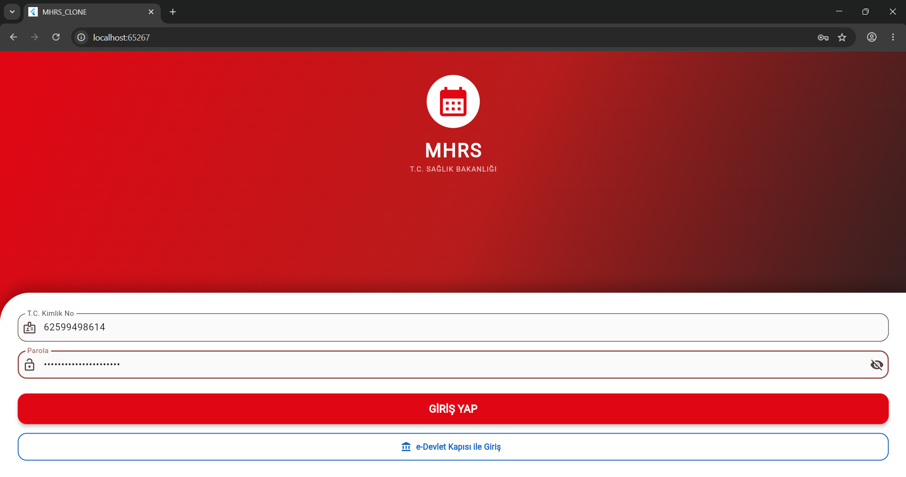
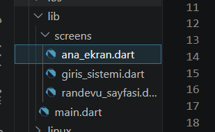
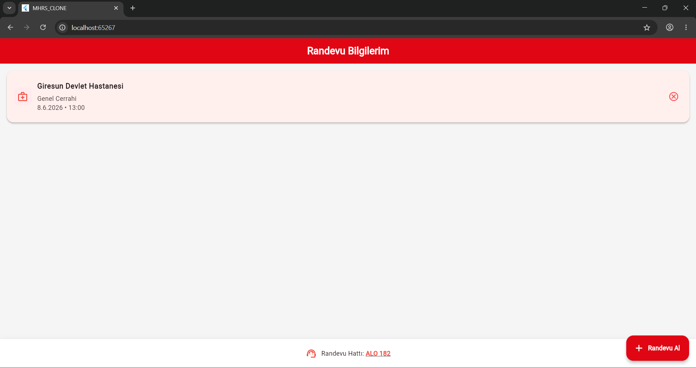

#  MHRS Klonu

Flutter ile geliştirilmiş, Merkezi Hekim Randevu Sistemi (MHRS) mobil uygulamasının arayüz klonudur. Bu proje, uygulamanın temel akışını ve ekran tasarımlarını içerir.

#  Özellikler

Uygulama şu anda aşağıdaki temel ekranları ve işlevleri içermektedir:

* Giriş Sistemi (`giris_sistemi.dart`): Kullanıcı adı/T.C. Kimlik No ve şifre ile güvenli giriş simülasyonu.
* Ana Ekran (`ana_ekran.dart`): Polikliniklerin, hastanelerin ve geçmiş randevuların listelendiği ekran.
* Randevu Sayfası (`randevu_sayfasi.dart`): İl,hastane, poliklinik,saat ve tarih seçilerek randevu alma adımlarının yönetildiği ekran.

# Kullanılan program
* Visual Studio Code(Flutter)

# Kullanılan dil
* Main.Dart 

## Ekran Görüntüleri

# Giriş Ekranı

* TC/Şifre ile giriş yapılan ekrandır

# Ana Ekran

* Ana_ekran, Giris_sistemi ve Randevu_sayfasını'kodlarını içeren ekrandır

# Randevu Ekranı

* Randevunun aktif gözüktüğü ekrandır

# Ad-Soyad-Numara
* Musa Öztürk 254602005